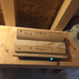

# Hangboard 

*STATUS: In Development - Towards a working demonstrator*

A universal force and velocity sensing hangboard mount with exercise timers for all hangboards.



# Design
This is a brief design layout of the project.

## Frontend
+ Web client (Running on the backend Raspberry Pi)
+ iOS App
+ Android App 

## Backend
+ Running on a Raspberry Pi.
+ Every task is running as a microservice and communicating to the frontend using websockets.

## Software Used
- Python Flask for Web App
- Websockets for Communication
- Python backends
- JSON for Board configuration and finger grip positions
- SVG Layers for hold configuration
- React Native for App

## Hardware Used
- Raspberry Pi Zero W
- Sensors: cf. hardware directory


# Developing

## Preparation
+ Follow the instructions in README.md in exercises and hangboard-app

## Running the Demonstrator Backend (including web interface)
+ Starting with docker (i.e. on OSX): ```docker-compose up --build```
+ Starting on a Raspi W zero: Run `./startup.sh` for running the backend.

### Manual startup
+ Start Exercises `cd exercises && python3 exercises.py --host 0.0.0.0 --port 4321 `
+ Start Gyroscope Sensors `cd hardware/gyroscope && python3 sensor_zlagboard.py --host 0.0.0.0 --port 4323`
+ Start Force Sensors `cd hardware/force_sensors && python3 force.py --host 0.0.0.0 --port 4322`
+ Start the Web App: `cd hangboard-web && python3 main.py --host 0.0.0.0 --port 8080`
+ Start the iOS App: `cd hangboardapp && ./build && yarn run ios`


## Creating software documentation
+ Run doxygen `doxygen`
+ Check output in `html`

# References
* Website: https://8ch9azbsfifz.github.io/hangboard/
* Discussions: https://github.com/8cH9azbsFifZ/hangboard/discussions
* Issues: https://github.com/8cH9azbsFifZ/hangboard/issues
+ [Raspi W Zero Hangboard](https://github.com/adrianlzt/piclimbing)
+ [Arduino Hangboard](https://github.com/oalam/isometryx)
