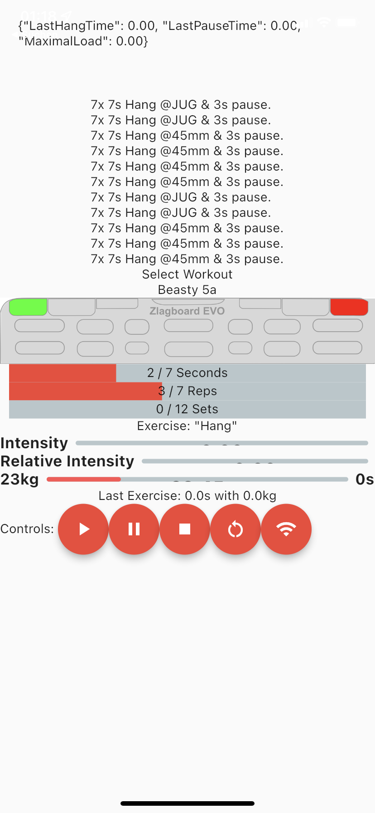

# Hangboard 
*A universal force and velocity sensing hangboard mount with exercise timers for all hangboards.*

## Why a universal smart hangboard?
Nowadays smart hangboards are becoming more and more popular. And there is a growing market for commercial
products (they are expensive).
All existing hangboard training apps have limitations (i.e. payed subscriptions,
limited to specific hangboards, buggy, sketchy to create new or custom training plans). 
+ Force sensing motherboard for beastmaker https://www.beastmaker.co.uk/products/motherboard
+ Force sensing smart hangboard https://climbro.com/
+ Force sesing smart hangboard https://www.smartboard-climbing.com/ 
+ Force sensing plate for smart hangboard training https://entralpi.com/ 

In the recent years
there have been a couple of attempts to create hombrew smart hangboards.
+ Raspi W Zero Hangboard: https://github.com/adrianlzt/piclimbing
+ Arduino Hangboard: https://github.com/oalam/isometryx 
+ HangOnIt https://github.com/MWaug/hangboard-app

This was motivation for me to learn new technologies and build an own smart hangboard - which is easy to reproduce for others.

## Features
- Measures hangtime, applied force, rate-of-force development, maximal load 
- Smart exercise timer - easily customizeable
- Uses preexisting exercise files - easily extendable
- Modular design for easy customization (further sensors, calculations, exercises, frontends)

# Getting started
*STATUS: In Development - Towards a reproduceable prototype.*

## What you need
- Any hangboard (large list of supported hangboards below).
- A Raspberry Pi, force sensors and some basic skills to setup the software backend (no automation so far).
- Basic skills to create a board mount with the force sensors.
- Any mobile device (iOS / Android) and some basic skills to deploy the app (no Store so far).
- A LED display, if you want to go without the app.
- Time and patience :)

## Preparing the Hangboard
+ [Hangboard Configuration](boards/README.md)
+ [Hangboard mounting options](boards/board_mount/README.md)

# Software Design
This is a brief design layout of the project. 

- Python backends
- MQTT for Communication 
- JSON for Board configuration and finger grip positions
- SVG Layers for hold configuration (will be converted to PNG in a cache, as flutter has no native SVG support)
- REST api for image and sound sources
- Flutter for the App

## Frontends
+ Web client (Running on the backend Raspberry Pi)
+ Smart Hangboard App 
+ 7 Segment display 
+ Moonboard progress bar

Further information can be found in [Frontend README](./frontend/README.md).

## Backend
- Running on a Raspberry Pi.
- Communicating to the frontend using MQTT.
- The default hostname for the MQTT broker is "hangboard". Modification is possible in backend and frontend with a variable so far.

Further information can be found in [Backend README](./backend/README.md).

### Software documentation
- The documentation is automatically generated using a commit hook on github and published on gh-pages.

#### API (MQTT)
The documentation of the backend API can be found here: https://8ch9azbsfifz.github.io/hangboard/api/index.html .

- AsyncAPI for documentation of the API

# Hardware Design
- Raspberry Pi Zero W
- Sensors: as listed below

All sensors can be wired at once following this schema:
[#img-hangboard-wiring]
.Hangboard wiring - all sensors
image::./hardware/hangboard_wiring.png[{half-size}Hangboard wiring - all sensors]
