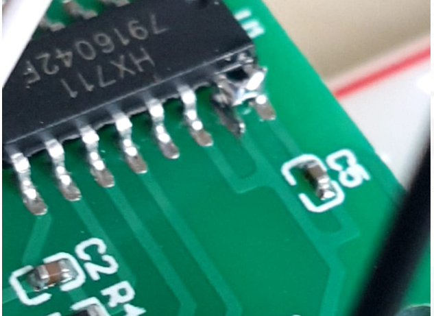

# Hangboard 

*STATUS: In Development - Towards a working demonstrator*

A universal force and velocity sensing hangboard mount with exercise timers for all hangboards.

# What you need
+ Any hangboard (large list of supported hangboards below).
+ A Raspberry Pi, force sensors and some basic skills to setup the software backend (no automation so far).
+ Basic skills to create a board mount with the force sensors.
+ Any mobile device (iOS / Android / WebApp) and some basic skills to deploy the debugging app (no Store so far)

## List of implemented hangboards
+ Beastmaker 1000
+ Beastmaker 2000
+ Cliffboard Mini
+ Crusher 3
+ Linebreaker Base
+ Metolius Prime
+ Metolius Project
+ Metolius Simulator 3D
+ Metolius Wood Grips 2 Compact
+ Monster
+ Mountain Rocks
+ Redge Port
+ Roots Baseline
+ Simond Ballsy Board
+ Topout Project
+ Zlagboard Evo
+ Zlagboard Mini

(More hangboards can be added easily - open a ticket).

## Features
+ Smart exercise timer 
+ Uses preexisting exercise files - easily extendable
+ Measures hangtime, applied force, rate-of-force development, maximal load etc

# Software Design
This is a brief design layout of the project.

## Frontend
+ Web client (Running on the backend Raspberry Pi)
+ iOS App
+ Android App 

## Backend
+ Running on a Raspberry Pi.
+ Every task is running as a microservice and communicating to the frontend using websockets.

## Software Used
- Python Flask for Web App
- Websockets for Communication (or RabbitMQ? - currently testing)
- Python backends
- JSON for Board configuration and finger grip positions
- SVG Layers for hold configuration
- React Native for App (or flutter? - currently testing)

# Developing
+ Running the Demonstrator Backend (including web interface)? -> Please look for the README.md instructions in the demonstrator releases.
+ Debugging the websockets `wscat -c "ws://localhost:4323/"`
+ Install flutter and configure correct paths
+ Prepare the virtual python environment
  ```
    python3 -m venv venv
    source venv/bin/activate
    python3 -m pip install -r requirements.txt
  ```

## Manual startup

+ Start backend service ```cd backend; python3 ./run_ws.py ```
+ Start the iOS / Android / Web App: `cd flutter_hangboard && flutter run`

## Creating software documentation
+ Run doxygen `doxygen` and check output in `html`


# Hardware Design
- Raspberry Pi Zero W
- Sensors: as listed below


## Force Sensors with HX711


- HX711 analog-to-digital converter
- Load Cells

### HX711 Fix

+ https://github.com/bogde/HX711/issues/172

### Raspi Wiring - HX711 to Load Cell

| Raspi GPIO | Module | Module Pin |
|------------|--------|------------|
| 3v3        | HX711  | Vcc        |
| GPIO17     | HX711  | DT         |
| GPIO27     | HX711  | SCK        |


### Mounting the load cells in a zlagboard
+ Disassemble the 4 screws and the gyroscope mount
+ Place the 4 load cells at bottom 
+ Create small "U-shaped" holds for the load cells (i.e. made from paper)
+ NB: Gyroscope mount disabled after placing the load cells...


### References
+ Datasheet doc/force/hx711_english.pdf
+ https://www.amazon.ca/Bridge-Digital-Amplifier-Arduino-DIYmalls/dp/B086ZHXNJH
+ https://arduino.stackexchange.com/questions/17542/connect-hx711-to-a-three-wire-load-cell
+ https://github.com/tatobari/hx711py
+ [HX711 Python module](https://github.com/gandalf15/HX711/)


## Gyroscope Sensor: MPU-6050


### Wiring the Gyroscope
| Raspi GPIO   | Module   | Module Pin |
|--------------|----------|------------|
| Pin 1 (3.3V) | MPU 6050 | VCC        |
| Pin 3 (SDA)  | MPU 6050 | SDA        |
| Pin 5 (SCL)  | MPU 6050 | SCL        |
| Pin 6 (GND)  | MPU 6050 | GND        |


### Software for the Gyroscope
Enable I2C I/O, load user space module and install I2C tools
```
sudo sed -i 's/\#dtparam=i2c_arm=on/dtparam=i2c_arm=on/g' /boot/config.txt
grep i2c-dev /etc/modules ||echo i2c-dev |sudo tee -a /etc/modules
sudo apt-get -y install i2c-tools
```
+ Reboot
+ Check whether 68 exists in `sudo i2cdetect -y 1 | grep 68`

### References
+ Datasheet: doc/gyroscope/MPU-6000-Register-Map1.pdf
+ Ref: https://github.com/rocheparadox/Kalman-Filter-Python-for-mpu6050
+ https://tutorials-raspberrypi.de/rotation-und-beschleunigung-mit-dem-raspberry-pi-messen/
+ More possibilities? There is a bluetooth version, too: https://github.com/fundiZX48/pymotiontracker


## Distance sensor HC-SR04

+ Must be used in conjunction with a kalman filter, of course.

### Hardware setup
| Raspi GPIO      | Module   | Module Pin |
|-----------------|----------|------------|
| Pin 2 (VCC)     | HC-SR04  | VCC        |
| Pin 6 (GND)     | HC-SR04  | GND        |
| Pin 12 (GPIO18) | HC-SR04  | TRIG       |
|                 | R1: 330Ω | ECHO       |
| Pin 18 (GPIO24) | R1: 330Ω |            |
|                 | R1: 330Ω | R2: 10kΩ   |
| Pin6 (GND)      |          |  R2: 10kΩ  |


### References
+ AZDelivery HC-SR04 Ultraschall Modul Entfernungsmesser Sensor kompatibel mit Raspberry Pi inklusive E-Book!
+ https://tutorials-raspberrypi.de/entfernung-messen-mit-ultraschallsensor-hc-sr04/
+ https://github.com/rizkymille/ultrasonic-hc-sr04-kalman-filter
+ https://github.com/NagarajSMurthy/Kalman-estimation-of-ultrasonic-sensor


# References
* Website: https://8ch9azbsfifz.github.io/hangboard/
* Discussions: https://github.com/8cH9azbsFifZ/hangboard/discussions
* Issues: https://github.com/8cH9azbsFifZ/hangboard/issues

## External references
+ [Raspi W Zero Hangboard](https://github.com/adrianlzt/piclimbing)
+ [Arduino Hangboard](https://github.com/oalam/isometryx)
