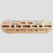

# Hangboard 

*STATUS: In Development - Towards a working demonstrator*

A universal force and velocity sensing hangboard mount with exercise timers for all hangboards.



# Design
This is a brief design layout of the project.

## Frontend
+ Web client (Running on the backend Raspberry Pi)
+ iOS App
+ Android App 

## Backend
+ Running on a Raspberry Pi.
+ Every task is running as a microservice and communicating to the frontend using websockets.

## Software Used
- Python Flask for Web App
- Websockets for Communication (or RabbitMQ? - currently testing)
- Python backends
- JSON for Board configuration and finger grip positions
- SVG Layers for hold configuration
- React Native for App (or flutter? - currently testing)

## Hardware Used
- Raspberry Pi Zero W
- Sensors: cf. hardware directory


# Developing
+  Running the Demonstrator Backend (including web interface)? -> Please look for the README.md instructions in the demonstrator releases.

### Manual startup
+ Start backend service ```cd backend; ../websocketd/websocketd --port=4321 python3 ./run_ws.py ```
+ Start the Web App: `cd hangboard-web && python3 main.py --host 0.0.0.0 --port 8080`
+ Start the iOS App: `cd hangboardapp && ./build && yarn run ios`


## Creating software documentation
+ Run doxygen `doxygen` and check output in `html`

# References
* Website: https://8ch9azbsfifz.github.io/hangboard/
* Discussions: https://github.com/8cH9azbsFifZ/hangboard/discussions
* Issues: https://github.com/8cH9azbsFifZ/hangboard/issues

## External references
+ [Raspi W Zero Hangboard](https://github.com/adrianlzt/piclimbing)
+ [Arduino Hangboard](https://github.com/oalam/isometryx)
