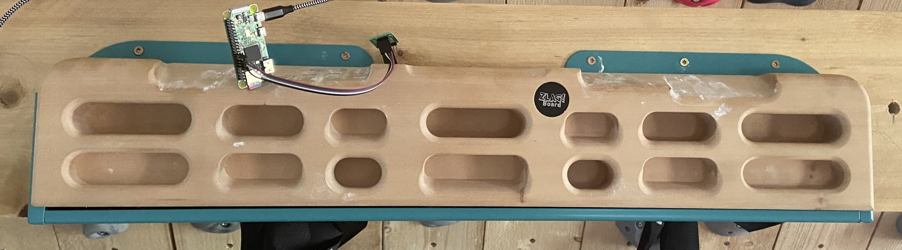
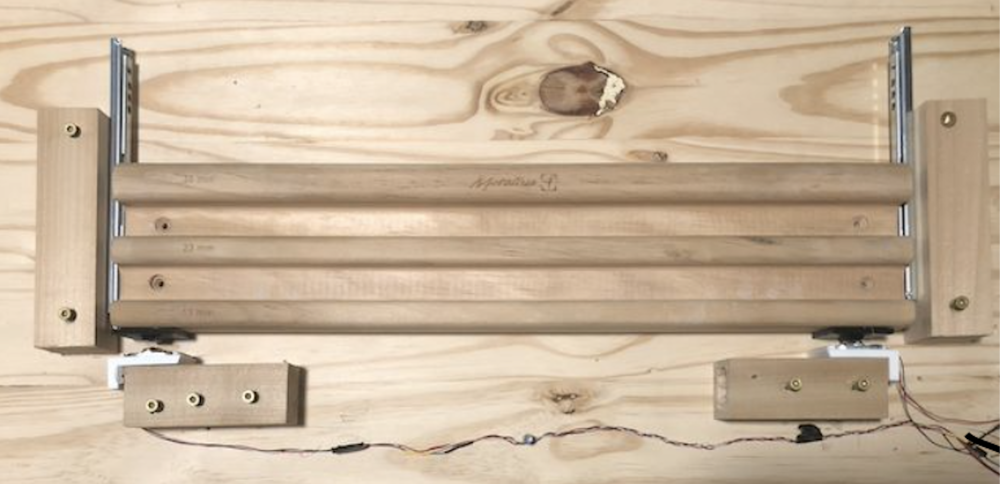

# Dimensions for mounting bracket load cells

- Width: 7,0 cm
- Height: 3,5 cm
- Forklets: 0,5 cm distance - 2,0 cm length
- 9-10cm sheets of paper

* cf. layout_cell_bracket image
* cf. images cell brackets 

Ref: https://www.instructables.com/Get-a-Hanging-Weight-Sensor-for-Your-Arduino-Proje/

# Variants for mounting the board with different load cells
## Zlagboard - Prototype 2

## Zlagboard - Prototype 1

Lessons learned (Why not recommended):
+ The load scale sensors must be used with a custom made mounting bracket
+ The slightest torsions or tilting leads to weight errors of up to 20%. 

## HangOnIt

+ HangOnIt https://github.com/MWaug/hangboard-app

## Paper

## Isometrix

+ No further details known, but there is obviously a metal frame behind the board.