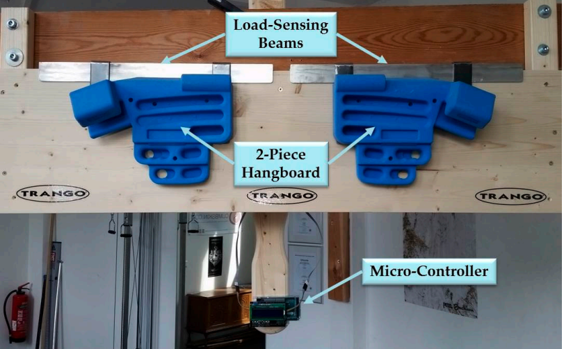
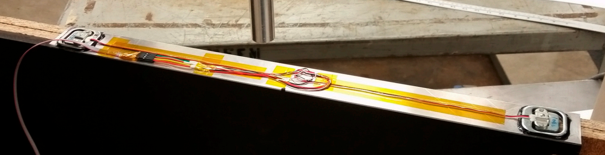

# Dimensions for mounting bracket load cells

# Variants for mounting the board with different load cells

## Zlagboard - Prototype 2

+ Zlagboard uses the same M6 screw as the load sensors. Therefore it can easily be mounted on the two load cells.

## Zlagboard - Prototype 1

Lessons learned (Why not recommended):
+ The load scale sensors must be used with a custom made mounting bracket
+ The slightest torsions or tilting leads to weight errors of up to 20%. 

## HangOnIt

+ HangOnIt https://github.com/MWaug/hangboard-app

## Anderson Method

+ Reference: Force-Sensing Hangboard to Enhance Finger Training in Rock Climbers, Michael Anderson

## Isometrix

+ No further details known, but there is obviously a metal frame behind the board.