= Hangboard Manual
Author Name <gerolf.ziegenain@gmail.com>
:hide-uri-scheme:
:leveloffset: 1

ifdef::backend-html5[]
:twoinches: width='144'
:full-width: width='100%'
:half-width: width='50%'
:half-size:
:thumbnail: width='60'
endif::[]
ifdef::backend-pdf[]
:twoinches: pdfwidth='2in'
:full-width: pdfwidth='100vw'
:half-width: pdfwidth='50vw'
:half-size: pdfwidth='50%'
:thumbnail: pdfwidth='20mm'
endif::[]
ifdef::backend-docbook5[]
:twoinches: width='50mm'
:full-width: scaledwidth='100%'
:half-width: scaledwidth='50%'
:half-size: width='50%'
:thumbnail: width='20mm'
endif::[]

:stem: 


*A universal force and velocity sensing hangboard mount with exercise timers for all hangboards.*

# Why a universal smart hangboard?
Nowadays smart hangboards are becoming more and more popular. But there is little market for commercial
products (they are expensive). All existing hangboard training apps have limitations (i.e. payed subscriptions,
limited to specific hangboards, buggy, sketchy to create new or custom training plans). In the recent years
there have been a couple of attempts to create hombrew smart hangboards (i.e. <<PiClimbing>> and <<ArduinoHangboard>>).

This was motivation for me to learn new technologies and build an own smart hangboard - which is easy to reproduce for others.

[#img-smart-hangboard]
.Smart Hangboard
image::./board_mount/smart_hangboard.png[{half-size}Smart Hangboard]

# What you need

- Any hangboard (large list of supported hangboards below).
- A Raspberry Pi, force sensors and some basic skills to setup the software backend (no automation so far).
- Basic skills to create a board mount with the force sensors.
- Any mobile device (iOS / Android / WebApp) and some basic skills to deploy the debugging app (no Store so far)

TIP: Further information can be found in the repository: https://github.com/8cH9azbsFifZ/hangboard.

# Features
- Smart exercise timer - easily customizeable
- Uses preexisting exercise files - easily extendable
- Measures hangtime, applied force, rate-of-force development, maximal load 

[#img-smart-hangboard]
.Smart Hangboard App
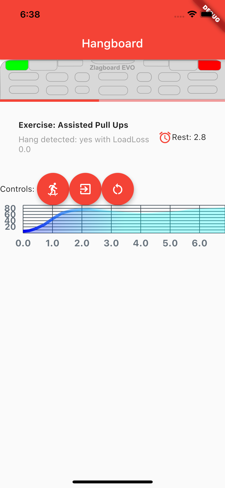

## List of implemented hangboards
- Beastmaker 1000
- Beastmaker 2000
- Cliffboard Mini
- Crusher 3
- Linebreaker Base
- Metolius Prime
- Metolius Project
- Metolius Simulator 3D
- Metolius Wood Grips 2 Compact
- Monster
- Mountain Rocks
- Redge Port
- Roots Baseline
- Simond Ballsy Board
- Topout Project
- Zlagboard Evo
- Zlagboard Mini

TIP: Your hangboard is not supported yet? It can be added easily. Just open a ticket: 
https://github.com/8cH9azbsFifZ/hangboard/issues/new

NOTE: Most of the boards configuration has been merged from the excellent project <<Boards>>.


# Software Design
This is a brief design layout of the project.

## Frontend
- Web client (Running on the backend Raspberry Pi)
- iOS App
- Android App 

## Backend
- Running on a Raspberry Pi.
- Communicating to the frontend using MQTT.
- The default hostname for the MQTT broker is "hangboard". Modification is possible in backend and frontend with a variable so far.

## Software Used
- Flutter for the frontends
- Python backends
- MQTT for Communication 
- JSON for Board configuration and finger grip positions
- SVG Layers for hold configuration

Currently inactive frontend implementations are
- React Native for App 


## Developing the software
For preparation install the following software:
- Install dependencies on raspi: `sudo apt-get install libxslt-dev`
- Install flutter and configure correct paths
- Prepare the virtual python environment
  ```
    python3 -m venv venv
    source venv/bin/activate
    python3 -m pip install -r backend/requirements.txt
  ```
- Install a fresh raspian on a SD card, put the corresponding wpa_supplicant.conf into the boot folder - ready for SSH :)

### Software documentation
- For manual documentation (manual creation): install `brew install asciidoctor` and create the PDF `cd doc; asciidoctor-pdf Manual.adoc`
- Documentation of the backend software can be created using `doxygen` (cf. Doxyfile).
- The documentation is automatically generated using a commit hook on github and published on gh-pages.

For manual startup:
- Start backend service ```cd backend; python3 ./run_ws.py ```
- Start the iOS / Android / Web App: `cd flutter_hangboard && flutter run`

#### API (MQTT)
The documentation of the backend API can be found here: https://8ch9azbsfifz.github.io/hangboard/api/index.html .

- AsyncAPI for documentation of the API
- For manual generation install ```npm install -g @asyncapi/generator ``` and run ```cd backend ; ag asyncapi.yaml @asyncapi/html-template -o ./docs```
- If you want to run MQTT locally on the raspi run `sudo apt-get -y install mosquitto`


#### Add App Icon
The application icon is located under `assets/icon`. The backgound source code image has been created using https://ray.so. 
- The PNG can be converted to icon sets using this tool: https://appicon.co/ .

For iOS follow these steps to configure the application icon:
- Start Xcode `open ios/hangboardapp.xcworkspace`
- On the root directory click on the folder named Images.xcassets.
- Import a new IconSet 


# Hardware Design
- Raspberry Pi Zero W
- Sensors: as listed below

All sensors can be wired at once following this schema:
[#img-hangboard-wiring]
.Hangboard wiring - all sensors
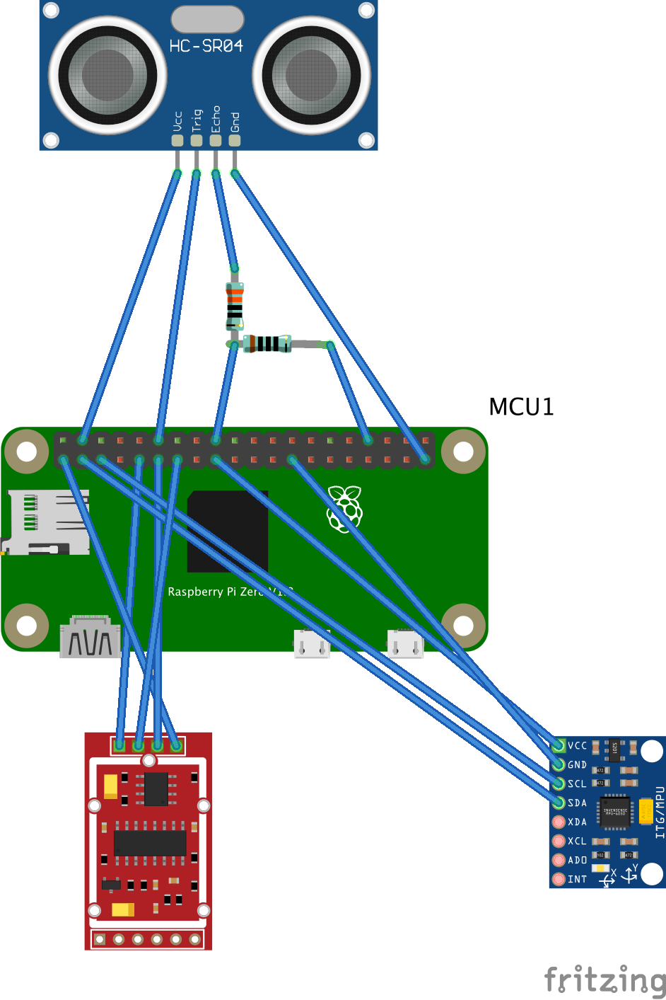

## Force Sensors with HX711
Load cells are available widely with the HX711 signal amplifier module as a package <<HX711LoadCellPackage>>. 
We will use one of these packages as the force measurement sensors.
The python module <<HX711PythonModule>> is slightly modified and contained in the backend sources.

[#img-hx711]
.The HX711 with 4 load cells
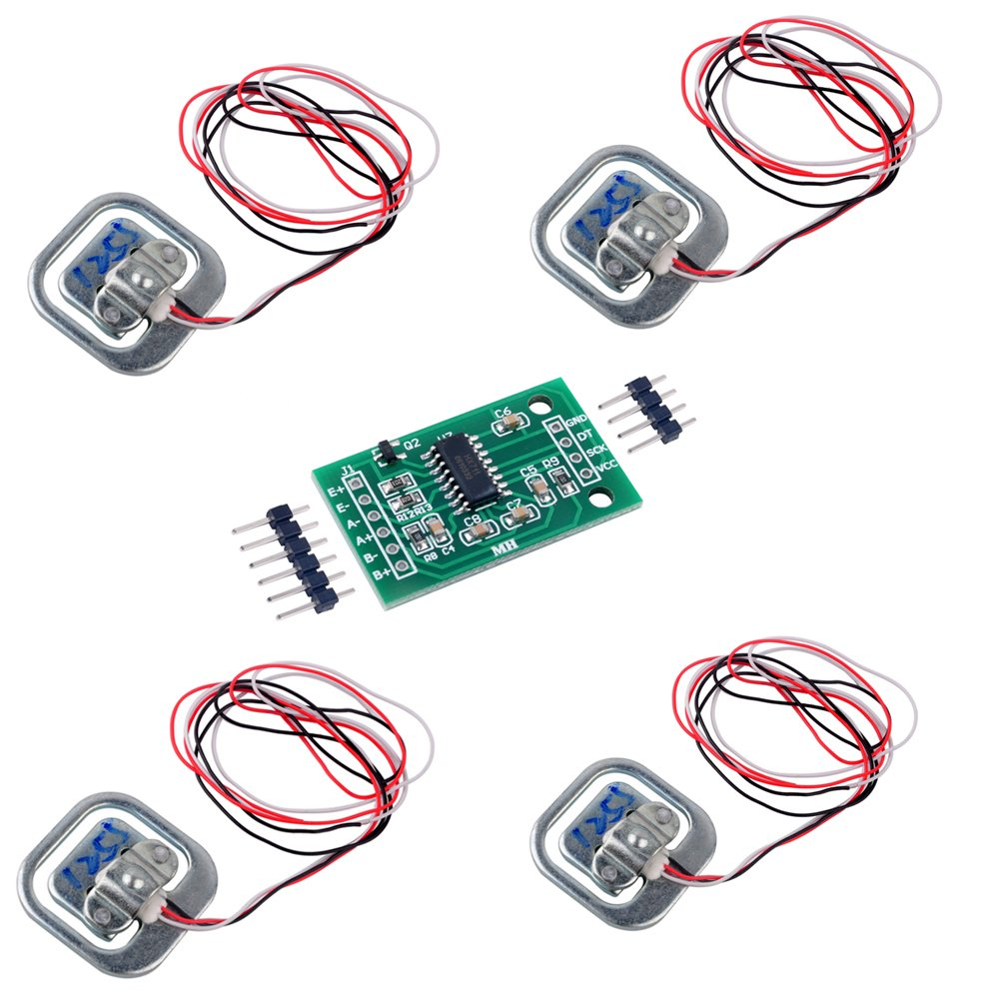
- HX711 analog-to-digital converter <<HX711Datasheet>>
- Load Cells

NOTE: Some HX711 modules have a wrong grounding according to the application sheet:
https://github.com/bogde/HX711/issues/172. This can be fixed with a small solder bridge.
[#img-hx711]
.The HX711 Fix
image::./force/hx711_fix.png[{half-size}The HX711 Fix]

Wire the HX711 module to the Raspberry Pi as follows:

[%header,cols="2,2,1"] 
|===
|Raspi GPIO
|Module
|Module Pin

|3v3
|HX711
|Vcc

|GPIO17
|HX711
|DT

|GPIO27
|HX711
|SCK

|===

Wire the 4 load cells as follows (according to the application sheet):

[#img-load-cell-wiring]
.Wiring four load cells
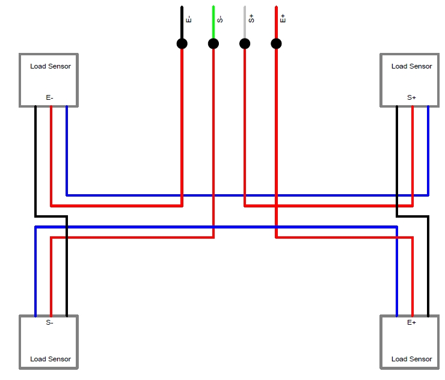

## Getting rid of the noise
As measured in <<<LPFvsKalman>>>: using a Low Pass Filter (moving average) is equivalent to a Kalman filter for HX711.

## Mounting the load sensors

### Mounting the load cells in a zlagboard

. Disassemble the 4 screws and the gyroscope mount
. Place the 4 load cells at bottom 
. Create small "U-shaped" holds for the load cells (i.e. made from paper)

[#img-zlagboard-disassembled]
.Zlagboard disassembled
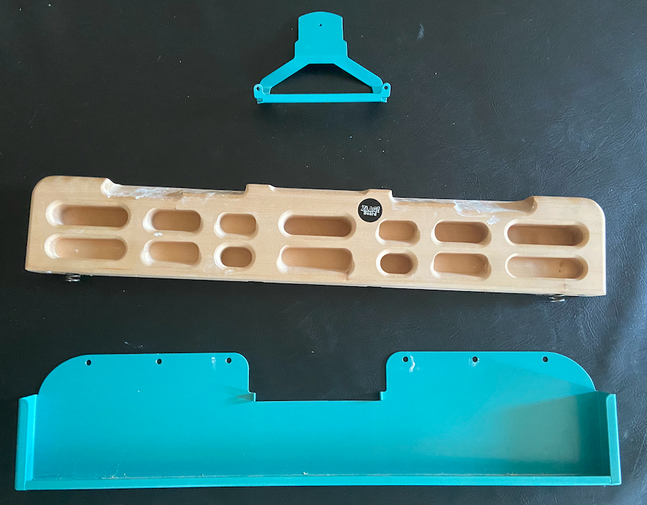

[#img-zlagboard-load-cells]
.Zlagboard with load cells
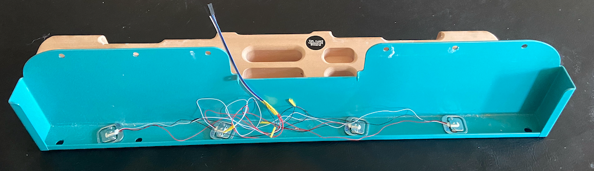

[#img-zlagboard-ushaped-mount]
.U-Shaped load cell mount
image::./force/load_sensor_zlagboard_mount.png[{half-size}U-Shaped load cell mount]

NOTE: Gyroscope mount disabled after placing the load cells...


### Mounting the load cells for any existing hangboard
Any hangboard can be mounted on a wooden construction with the 4 load cells in 
between. This will provice force measurements for any existing hangboard.

An example construction of a hangboard mount is given here: <<#img-mount-isometrix-board>>.

[#img-mount-isometrix-board]
.Mount for Isometrix Board <<ArduinoHangboard>>
image::./board_mount/IsometrixBoard.png[{half-size}Mount for Isometrix Board]


## Gyroscope Sensor: MPU-6050
Without further modifications a gyroscoope sensor can be mounted on an existing Zlagboard.
Hangs can be measured with the gyroscope, too. We will use the widely used MPU6050 package 
<<MPU6050Datasheet>> with excellent documentations <<MPU6050GettingStarted>>. 
Obviously there will be noise in the measurements, so for accurate 
measurements in our setup a kalman filter is implemented in the backend, based on this implementation
<<MPU6050KalmanFilter>>.

CAUTION: Force measurements are not possible without the load cells.

NOTE: Modules with BLE are existing for further / future developments <<MPU6050BLEVersion>>.

[#img-sensor-mpu-6050]
.Sensor MPU-6050
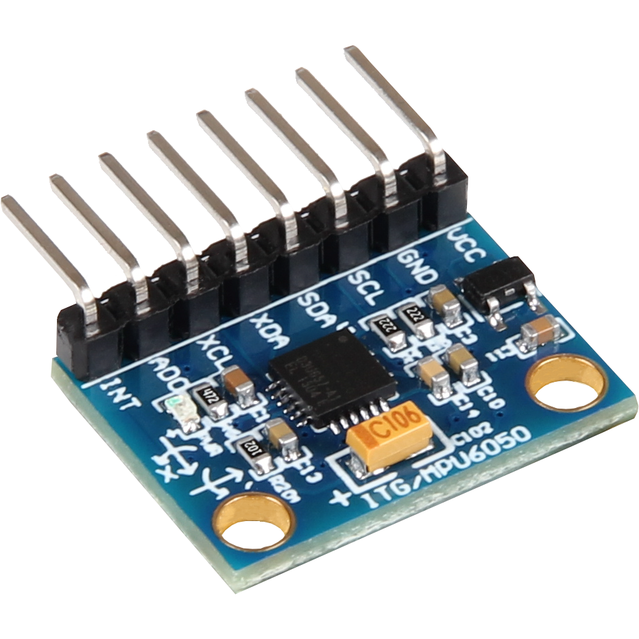

Wire the Gyroscope sensor to the raspi as follows:

[%header,cols="2,2,1"] 
|===
|Raspi GPIO
|Module
|Module Pin

|Pin 1 (3.3V)
| MPU 6050
|VCC

|Pin 3 (SDA
| MPU 6050
|SDA

|Pin 5 (SCL)
| MPU 6050
|SCL

| Pin 6 (GND)
| MPU 6050
|GND

|===


For getting started with the software for the Gyroscope, follow these steps

. Enable I2C I/O `sudo sed -i 's/\#dtparam=i2c_arm=on/dtparam=i2c_arm=on/g' /boot/config.txt`
. Load the user space module `grep i2c-dev /etc/modules ||echo i2c-dev |sudo tee -a /etc/modules`
. Install I2C tools `sudo apt-get -y install i2c-tools`
. Reboot `sudo reboot`
. Check whether 68 exists in `sudo i2cdetect -y 1 | grep 68`


## Distance sensor HC-SR04
WARNING: This sensor is not yet fully implemented in the backend.

For measuring distances (i.e. for pullups) we will use a HC-SR04 ultrasonic distance sensor <<HCSR04Package>>.
There is excellent documentation on how to getting started <<HCSR04GettingStarted>>.
For accurate measurements a kalman filter is implemented in the backend based on <<HCSR04KalmanFilter>>.
More information also can be found in <<KalmanHCSR04>>.

Other alternatives are <<<VelocityBraincoder>>>.

[#img-sensor-hc-sr04]
.Sensor HC-SR04
image::./distance_sensors/doc/71YRg95095L._SL1500_.jpg[{half-size}Sensor HC-SR04]


Wire the distance sensor to the raspi as follows:

[%header,cols="2,2,1"] 
|===
|Raspi GPIO
|Module
|Module Pin

|Pin 2 (VCC)
| HC-SR04 
|VCC

|Pin 6 (GND)  
| HC-SR04 
|GND

|Pin 12 (GPIO18)
| HC-SR04 
|TRIG

|
| R1: 330Ω 
| ECHO 

| Pin 18 (GPIO24) 
| R1: 330Ω 
|          

|                 
| R1: 330Ω 
| R2: 10kΩ   

| Pin6 (GND)      
|          
|  R2: 10kΩ  

|===


# Training plans, Workouts, Exercises and Sets
The following definitions will be used:

Training Plan:: A series of workouts, usually executed with at least of one day rest in between.
Workout:: A series of exercise sets.
Excercise:: A single exercise, i.e. hang, maximal hang, pull up, assisted pull up.
Set:: A set of exercises with *Repetitions*, *Pause* between the exercises and a *rest to start* pause.

## Workout files
*TODO*

## Creating a custom workout based on MVC
Once you have measured your MVC, you can create a custom workout using the script:
`exercises/mvc_workout_creator.py`.


# Measurements, their definitions and what to learn from them
The following values are measured. For more informations on their meaning refer to the papers given in the references.
*TODO*

MVC:: *TODO*

RFD:: Rate of force development (N/s) *TODO*

FTI:: Force-Time-Integral *TODO*

Average Load:: *TODO*

Maximal Load:: *TODO*

Load Loss:: *TODO*

Load:: *TODO*


## Evaluations of the measured data

From the MVC we can estimate the maximal boulder grade according to [[[MVC1]]] using 
the script in `evaluations/estimate_bouldergrade_from_mvc.py`.

Here are some first test measurement data sets. The test has been conducted with a hang, one handed pulls, a fast and a slow pullup.
The data and evaluation scripts can be found in the directory `evaluations`.

[#img-measurement-test1-load]
.Measurement of Load (Test 1)
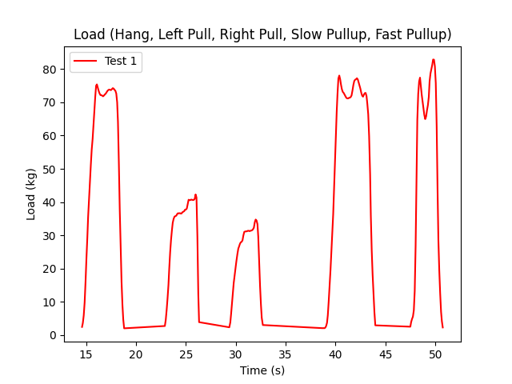

[#img-measurement-test1-loadavg]
.Measurement of average Load (Test 1)
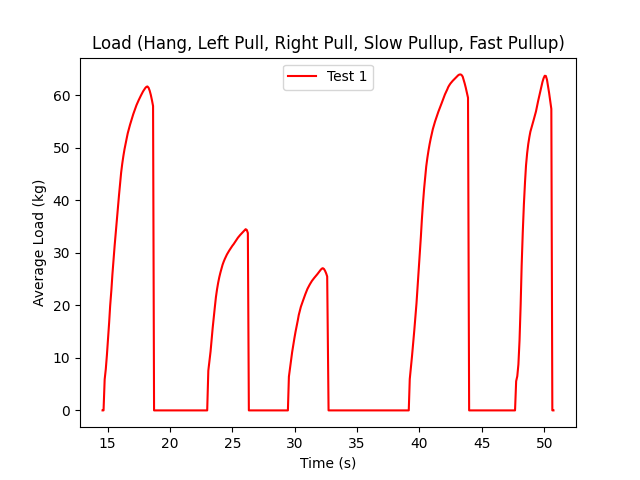

[#img-measurement-test1-loadmax]
.Measurement of maximal Load (Test 1)
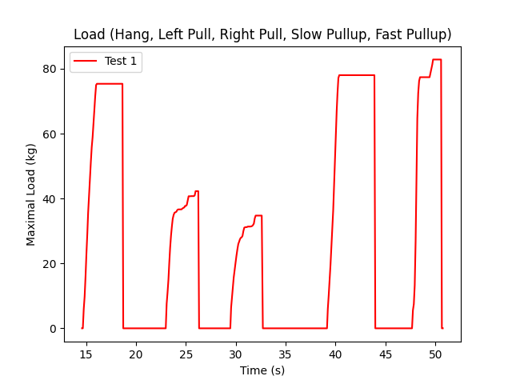

[#img-measurement-test1-loadloss]
.Measurement of Load Loss (Test 1)
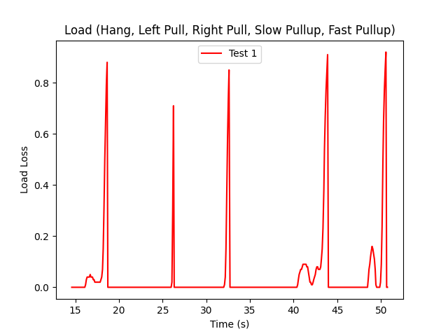

[#img-measurement-test1-fti]
.Measurement of FTI (Test 1)
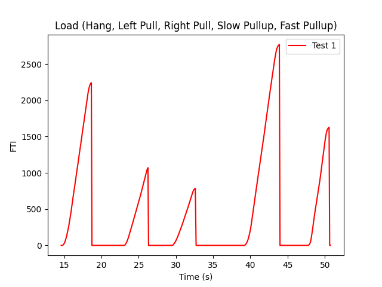

[#img-measurement-test1-rfd]
.Measurement of RFD (Test 1)
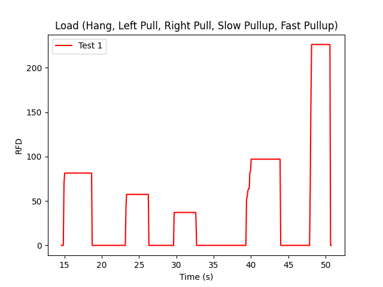


# Hangboards
For every hangboard supported there is a JSON file containing the hold names and dimensions and an SVG image with all the holds.

Luckily there is a similar project and lots of configurations are already implemented <<Boards>>. These boards have been merged to this
repository.
Measuring a hangboard is lots of work, i.e. <<Beastmaker1000HoldSizes>>.


[bibliography]
== References
* [[[Website]]] Hangboard website: https://8ch9azbsfifz.github.io/hangboard/
* [[[Discussions]]] Hangboard discussions: https://github.com/8cH9azbsFifZ/hangboard/discussions
* [[[Issues]]] Hangboard issues: https://github.com/8cH9azbsFifZ/hangboard/issues
* [[[PiClimbing]]] Raspi W Zero Hangboard: https://github.com/adrianlzt/piclimbing
* [[[ArduinoHangboard]]] Arduino Hangboard: https://github.com/oalam/isometryx
* [[[HX711Datasheet]]] HX 711 Datasheet: https://github.com/8cH9azbsFifZ/hangboard/raw/main/doc/force/hx711_english.pdf
* [[[HX711LoadCellPackage]]] Package of HX711 module and 4 load cells: https://www.amazon.ca/Bridge-Digital-Amplifier-Arduino-DIYmalls/dp/B086ZHXNJH
* [[[HX711PythonModule]]] The python modules for HX711: https://github.com/tatobari/hx711py or https://github.com/gandalf15/HX711/
* [[[MPU6050Datasheet]]] MPU 6050 Datasheet: https://github.com/8cH9azbsFifZ/hangboard/raw/main/doc/gyroscope/MPU-6000-Register-Map1.pdf
* [[[MPU6050KalmanFilter]]] Kalman filter implementation for MPU 6050: https://github.com/rocheparadox/Kalman-Filter-Python-for-mpu6050
* [[[MPU6050GettingStarted]]] Getting started with MPU6050 measurements: https://tutorials-raspberrypi.de/rotation-und-beschleunigung-mit-dem-raspberry-pi-messen/
* [[[MPU6050BLEVersion]]] MPU6050 BLE module: https://github.com/fundiZX48/pymotiontracker
* [[[HCSR04Package]]] HC-SR04 package: https://www.amazon.de/AZDelivery-HC-SR04-Ultraschall-Entfernungsmesser-Raspberry/dp/B07TKVPPHF/
* [[[HCSR04GettingStarted]]] Getting started with distance measurements using the HC-SR04: https://tutorials-raspberrypi.de/entfernung-messen-mit-ultraschallsensor-hc-sr04/
* [[[HCSR04KalmanFilter]]] Implementations of kalman filters for the HC-SR04 module: https://github.com/rizkymille/ultrasonic-hc-sr04-kalman-filter and https://github.com/NagarajSMurthy/Kalman-estimation-of-ultrasonic-sensor
* [[[Beastmaker1000HoldSizes]]] Accurate measurements of the Beastmaker 1000 hold dimensions: https://rupertgatterbauer.com/beastmaker-1000/#:~:text=Speaking%20of%20design%2C%20the%20Beasmaker,slopers%20and%20pull%2Dup%20jugs.
* [[[Boards]]] Project with lots of hangboard configurations: https://github.com/gitaaron/boards
* [[[ClimbHarderSurvey]]] https://www.reddit.com/r/climbharder/comments/6693ua/climbharder_survey_results/ and the data stored here `doc/references/ClimbHarderSurvey`
* [[[CriticalForceCalculator]]] https://strengthclimbing.com/critical-force-calculator/
* [[[ClimbingFingerStrengthAnalyzer]]] https://strengthclimbing.com/finger-strength-analyzer/
* [[[ForceSensingHangboardToEnhangeFingerTraining]]] Force-Sensing Hangboad to Enhance Finger Training in Rock Climbers, M. Anderson (https://github.com/8cH9azbsFifZ/hangboard/raw/main/doc/references/Force-Sensing_Hangboard_to_Enhance_Finger_Training_in_Rock_Climbers.pdf)
* [[[VelocityBraincoder]]] Braincoder velocity sensor https://github.com/8cH9azbsFifZ/hangboard/raw/main/doc/references/Braincoder.pdf
* [[[MVC1]]] Optimizing Muscular Strength-to-Weight Ratios in Rock Climbing, https://github.com/8cH9azbsFifZ/hangboard/raw/main/doc/references/BF_strength_climbing_correlations-MAR282018web.pdf
* [[[LPFvsKalman]]] Simple Effective and Robust Weight Sensor for Measuring Moisture Content in Food Drying Process, https://github.com/8cH9azbsFifZ/hangboard/raw/main/doc/references/SM1941.pdf
* [[[MVC2]]] Tendinous Tissue Adaptation to Explosive- vs. Sustained-Contraction Strength Training, https://github.com/8cH9azbsFifZ/hangboard/raw/main/doc/references/fphys-09-01170.pdf
* [[[KalmanHCSR04]]]  Kalman Filter Algorithm Design for HC-SR04 Ultrasonic Sensor Data Acquisition System, Adnan Rafi Al Tahtawi https://github.com/8cH9azbsFifZ/hangboard/raw/main/doc/references/Kalman_Filter_Algorithm_Design_for_HC-SR04_Ultraso.pdf
