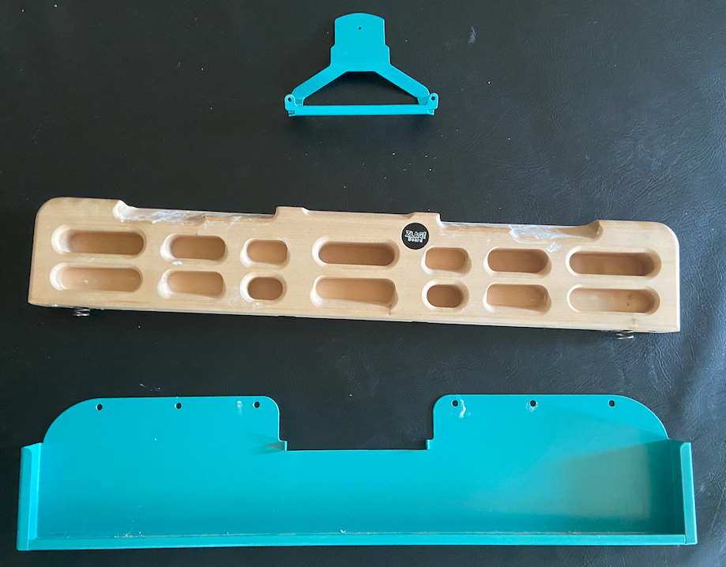
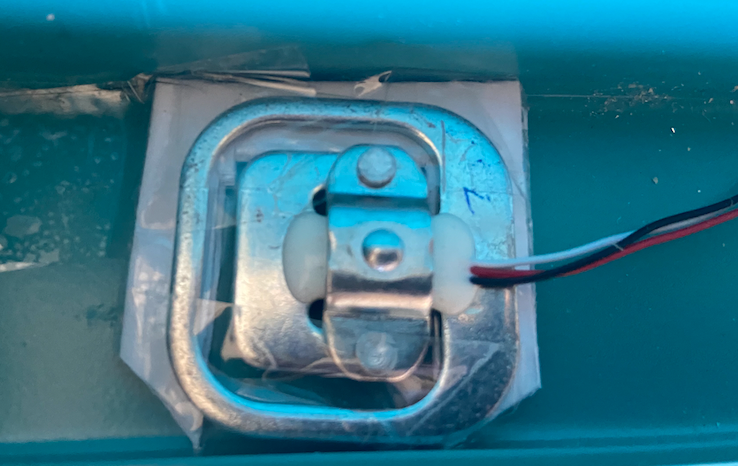

# Force Sensors


- *Not implemented yet*
- HX711 analog-to-digital converter
- Load Cells

# Software
Running on raspi
```
python3 -m venv venv
source venv/bin/activate
python3 -m pip install -r requirements.txt
python3 force.py --host 0.0.0.0 --port 4322
```
Or using docker
```
docker build . -t force
docker run --rm -it -p 4322:4322 force
```

# Hardware Setup

## HX711 Fix

+ https://github.com/bogde/HX711/issues/172

## Raspi Wiring - HX711

| Raspi GPIO | Module | Module Pin |
|------------|--------|------------|
| 3v3        | HX711  | Vcc        |
| GPIO17     | HX711  | DT         |
| GPIO27     | HX711  | SCK        |


## HX711 Wiring - Load Cell


## Mounting the load cells in a zlagboard
+ Disassemble the 4 screws and the gyroscope mount
+ Place the 4 load cells at bottom 
+ Create small "U-shaped" holds for the load cells (i.e. made from paper)
+ NB: Gyroscope mount disabled after placing the load cells...





# References
+ https://www.amazon.ca/Bridge-Digital-Amplifier-Arduino-DIYmalls/dp/B086ZHXNJH
+ https://arduino.stackexchange.com/questions/17542/connect-hx711-to-a-three-wire-load-cell
+ https://github.com/tatobari/hx711py
+ [HX711 Python module](https://github.com/gandalf15/HX711/)
