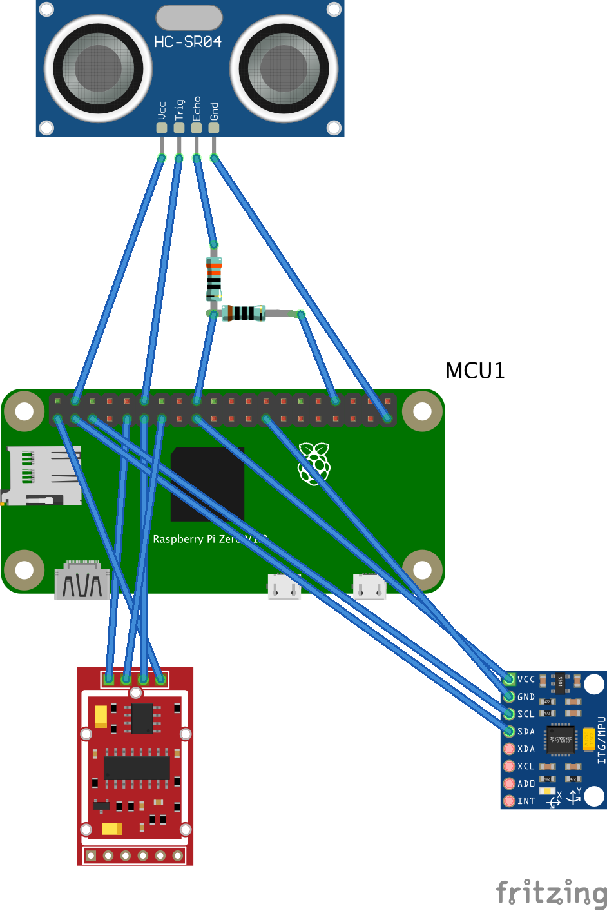

# Hardware build
This directory contains the hardware build instructions.

# Installation
+ Flash a new raspian with ssh and wifi, and install git: `apt-get -y install git`
+ Clone this repo: `git clone https://github.com/8cH9azbsFifZ/hangboard.git`
+ Run installation scripts in current directory: `./install_raspi.sh`

# Wiring

+ Have a look in the subdirectories for the specific module wiring configuration.
+ Drawing the wires: ```brew install fritzing``` and open the wiring diagram in this directory.