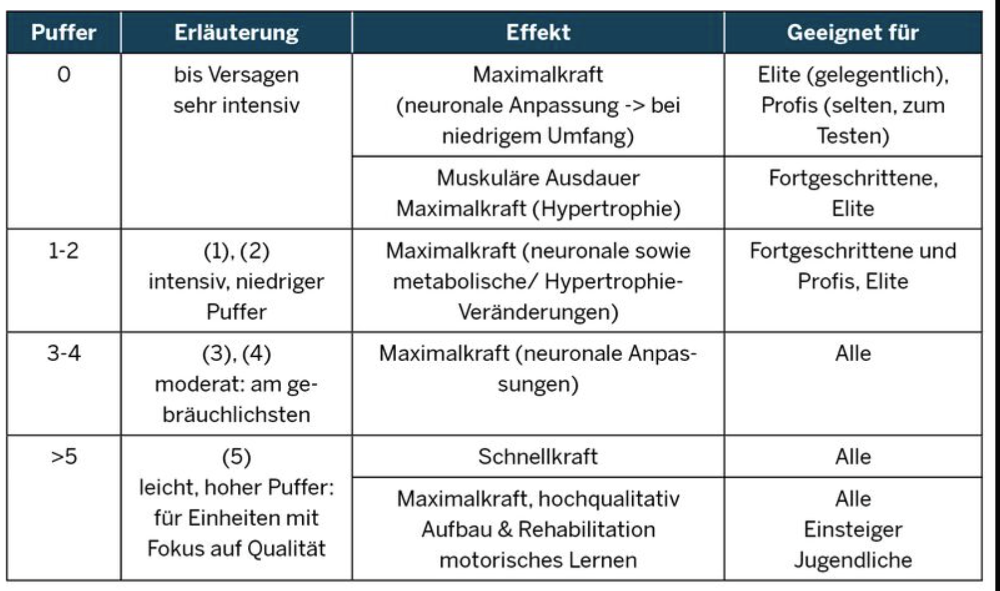

# Exercises
This directory contains the exercise files and the corresponding classes for serving the timers.
+ [TODO](./TODO.md).

## Add new exercises
+ Create a new JSON file for the exercise.

# Discussion of various exercises
This section serves as a reference for the implementation of the various exercises implemented in the JSON files.

## Eva López MaxHangs strength training protocol 
+ Always warm up properly before doing the MaxHangs hangboard routine.
+ Perform three to four sets with increasing added weight or decreasing edge depth (50 – 90% of the previous session’s load).
+ The number of MaxHangs sets can be varied between 2 – 5. (Beginners should start with two sets.)
+ The hang time can be varied between 5 – 15 seconds. (Typical hang time: 10 seconds.)
+ The margin is also called the effort level (EL)  and may be varied between 1 – 5 seconds. Leaving a margin leads to similar results as reaching failure, but reduces the risk of injury. (Typical margin: 3 seconds.)
+ The rest time between sets can be varied between 3 – 5 minutes. (Typical rest time between sets: 3 minutes.)

### Margin

### Eva López MaxHangs hangboard routine details (MED)
+ Choose an edge on which you can hang for only 6 – 20 seconds.
+ Hang for 5 – 15 seconds (leave a 1 – 5-second margin), rest for 3 – 5 minutes.
+ Complete 2 – 5 sets.
+ For the MaxHangs MED protocol, an edge between 5 – 10 mm is usually chosen. 
+ During each set try to assess the time margin you have left on the hangs. 
  + If you feel like your margin exceeds 3 – 5 seconds, decrease the edge depth by 1 – 2 mm, according to the perceived effort.
  + If you feel like your margin approaches zero, increase the edge depth by 1 – 2 mm, according to the perceived effort.

### Eva López MaxHangs hangboard routine details (MAW)
+ Choose a grip position to train.
+ Add enough weight to be able to hang for only 6 – 20 seconds.
+ Hang for 5 – 15 seconds (leave a 1 – 5-second margin), rest for 3 – 5 minutes.
+ Complete 2 – 5 sets.
+ For the MaxHangs MAW protocol, an edge between 8 – 22 mm is usually chosen, but you can do it for any hold. (Typical added load: 5 – 55 kg.)
+ During each set try to assess the time margin you have left on the hang.
  + If you feel like your margin exceeds 3 seconds, add 2 – 5 kg for the next set, depending on bodyweight.
  + If you feel like your margin approaches zero, subtract 2 – 5 kg for the next set, depending on bodyweight.

## The “7-53” fingerboard protocol details - Eric Hörst
+ Choose two to five different grip positions. Consider including:
  + Half crimps
  + Full crimps
  + Three-finger pockets
  + Two-finger pockets: index-middle (IM), middle-ring (MR) and ring-pinkie (RP) – advanced
  + Deep monos
+ For each grip position determine the amount of added or subtracted weight, allowing you to hang for 10 seconds.
+ For each grip position:
  + Hang for 7 seconds, rest for 53 seconds.
  + Complete a total of 3 hangs per set.
  + Rest 3 – 5 minutes and switch to the next grip position.
  + Complete a total of 2 – 5 sets.

## Eva López IntHangs strength endurance fingerboard protocol

+ Always warm up properly before doing IntHangs strength endurance hangboard workouts.
+ Perform four to five 10-second sets, with a 5-second pause and decreasing edge depth or increasing load.
+ For the first warm-up set, the edge depth/load should allow you to hang for one minute.
  + In the case of the IntHangs MED protocol, this is roughly equivalent to an edge 5 – 10 mm deeper than the training edge from your previous session [6].
  + In the case of the IntHangs MAW protocol, this is roughly equivalent to 60% of your MVC.
+ For the first training session, the edge depth/load should be chosen in such a way so that you can hang for roughly 30 seconds.
+ 30-second tests are time-consuming and put a lot of strain on your fingers and shoulders.
  + For the MAW method, consider performing a 5 – 10-second MVC test and using 60 – 80%  of the determined maximum load.
  + For the MED method, consider using Table 2, to determine the initial edge depth.
+ You should aim to fail on the last repetition of the last set. This may require adjusting the edge size/load after each set or even repetition, to control the intensity on the fly.
+ The hang time can be varied between 7 – 10 seconds.
+ Typical hang time: 10 seconds
+ The rest time between hangs can be varied between 3 – 30 seconds.
+ Typical rest time between hangs: 5 seconds.
+ The rest time between sets can be varied between 1 – 2 minutes.
+ Typical rest time between sets: 1 minute.
+ Each set corresponds to an average time required to climb through a crux section on a sport route.
+ The 5-second rest between hangs is in line with the observed minimum time of 3 – 5 seconds for oxygenation between isometric, high-intensity intermittent contractions.
+ The 1-minute rest between sets does not allow to fully recover maximum strength, which is targeted at working strength endurance.
+ The IntHangs MAW method is only recommended for advanced climbers with a lot of training experience.
+ The IntHangs strength endurance fingerboard protocols can be applied to any grip position, although the half crimp is the most common one.
+ Execute an 8-week strength training cycle, before you engage in strength endurance training, to maximize gains.

### IntHangs MED strength endurance fingerboard routine details
+ Choose an edge on which you can hang for roughly 30 seconds without added load. (Typical edge depth: 8 – 22 mm.)
+ Hang for 7 – 10 seconds, rest for 3 – 30 seconds.
+ Perform 4 – 5 hangs per set.
+ Rest for 1 – 2  minutes between sets.
+ Perform 3 – 5 sets.

### IntHangs MAW strength endurance fingerboard routine details
+ Choose an edge on which you want to train. (Typical edge depth: 10 – 18 mm.)
+ For the chosen edge, determine the load allowing you to hang for roughly 30 seconds.
+ Hang for 7 – 10 seconds, rest for 3 – 30 seconds.
+ Perform 4 – 5 hangs per set.
+ Rest for 1 – 2  minutes between sets.
+ Perform 3 – 5 sets.

## Eva López SubHangs strength endurance protocol
+ The SubHangs strength endurance MAW protocol is only recommended for advanced climbers with a lot of training experience. Beginners and intermediate should stick to SubHangs MED.
+ Make sure to warm up your shoulders before you start the protocol. The longer hangs, above 30 seconds, can be very straining on the shoulders and potentially lead to rotator cuff injuries.
+ You can tailor the program to suit your current performance requirements: 
  + If you need to improve your recovery time between sustained sections of a route, you should start with long rests of 2 – 3 minutes between sets. Shorten the rests gradually while progressing through the program, down to a minimum of 30 seconds. Keep the hang duration or load constant.
  + Alternatively, if you need to be able to hold a specific grip position for a longer time, you can increase the hang period and keep the pause unchanged.
+ If the pause between sets is less than 2 minutes, select the load in such a way, so that you reach failure or near-failure in the last hang of the session.
+ If the pause between sets is 2 – 3 minutes, select the load in such a way so that you reach failure or near-failure at the end of each set.
+ You may need to adjust the load (SubHangs MAW) or edge depth (SubHangs MED) for each set or even repetition, to reach failure exactly when it is required.
+ Training frequency
  + For improving your strength endurance perform the drills twice a week, with  48 – 72 hours recovery between the sessions.
  + If you want to maintain your current strength endurance level, exercising once a week should be sufficient.
  + For advanced climbers who train 5-6 times per week, three SubHangs sessions a week are possible if they don’t climb during the weekends.

### Typical SubHangs strength endurance training cycles
+ The basic principle for the SubHangs protocols is to create a training overload by progressing the volume. 
+ Once the progress slows down, you should start changing other workout parameters. You may try the following two approaches:
  + Keep the hang intensity and recovery times fixed while extending the hang duration up to 45 seconds.
  + Keep the hang intensity and hang times fixed while shortening the recovery time between sets down to 30 seconds.

### Eva López SubHangs MED protocol details
+ Choose an edge on which you can hang between 20 and 45 seconds.
+ Perform one hang of 20 – 45 seconds, rest for 30 seconds up to 2 minutes.
+ Perform 4 – 8 sets.

### Eva López SubHangs MAW protocol details
+ Choose an edge between 14 – 20 mm and a corresponding load, so that you can hang between 20 and 45 seconds.
+ Perform one hang of 20 – 45 seconds, rest for 30 seconds up to 2 minutes.
+ Perform 4 – 8 sets.

# Density Hangs
+ Choose 2 - 3 hold positions for training. Consider:
  + Slopers
  + Half crimp
  + Open hand
  + Full-crimp
  + Pinch (you may use pinch blocks)
+ For each position, choose a hold on which you can hang with two arms between 20 and 45 seconds, ideally without added load.
+ Perform a set of Density Hangs:
  + Hang for 20 - 40 seconds.
  + Rest for 10 - 20 seconds - use 1:2 hang to rest ratio.
  + Perform 2 - 3 reps - until you fail.
  + If you can do more than 3 reps, you can add 1 – 2 more, or increase the duration of the last rep until you fail.
+ Rest 3 - 5 minutes
+ Repeat the set for the same hold position or move to the next position.
+ For each hold position, perform 2 - 3 sets. That amounts to 4 - 9 sets per training session.
  + According to Dr. Nelson, doing 8 sets is often the ideal training volume.

+ Focus on slow static loading until muscular failure
+ Density hangs are ideally performed without added load, at around 75% of maximum strength (MVC-7)
  + To calculate your Density Hangs loads and training edge sizes, you may use my Hangboard Training Calculator [9].
  + Strong athletes should consider doing multiple reps until failure (Repeater style) instead of adding load - 1:2 hang to rest ratio works well in this case.
  + If you are strong enough, you may experiment with one arm hangs - it may be necessary to use a pulley setup or a rubber band for assistance.
  + It is better to use relatively large edges (20 - 35 mm) to reduce the risk of finger injury.
+ Progress by increasing the time to failure on the chosen edge size or drop the edge size if you can hit 30-seconds easily.
  + Be careful not to overdo training on small edges – it puts a lot of stress on the fingers, particularly at high training volumes.
+ To add variety to your hangboard sessions and to maintain an elevated heart rate, you can make circuits, to include lower extremity and upper extremity (bar isometrics) workouts in between individual hangs.
+ A typical training cycle is 4 – 5 weeks.

# References
* Excellent summary of the routines by Eva Lopez https://strengthclimbing.com/eva-lopez-maxhangs/ and https://strengthclimbing.com/eva-lopez-subhangs-climbing-endurance-protocol/
+ Density Hangs by Tylor Nelson: https://strengthclimbing.com/dr-tyler-nelsons-density-hangs-finger-training-for-rock-climbing/
* Excellent summary of the routines by Eric Hörst: https://strengthclimbing.com/eric-horst-7-53-hangboard-routine/
* CriticalForceCalculator https://strengthclimbing.com/critical-force-calculator/
* ClimbingFingerStrengthAnalyzer https://strengthclimbing.com/finger-strength-analyzer/
* ForceSensingHangboardToEnhangeFingerTraining Force-Sensing Hangboad to Enhance Finger Training in Rock Climbers, M. Anderson 
* MVC1 Optimizing Muscular Strength-to-Weight Ratios in Rock Climbing
* MVC2 Tendinous Tissue Adaptation to Explosive- vs. Sustained-Contraction Strength Training
* LatticeMVC The determination of finger flexor critical force in rock climbers 

<a id="ClimbHarderSurvey">[5]</a>https://www.reddit.com/r/climbharder/comments/6693ua/climbharder_survey_results/ and the data stored here `doc/references/ClimbHarderSurvey`
