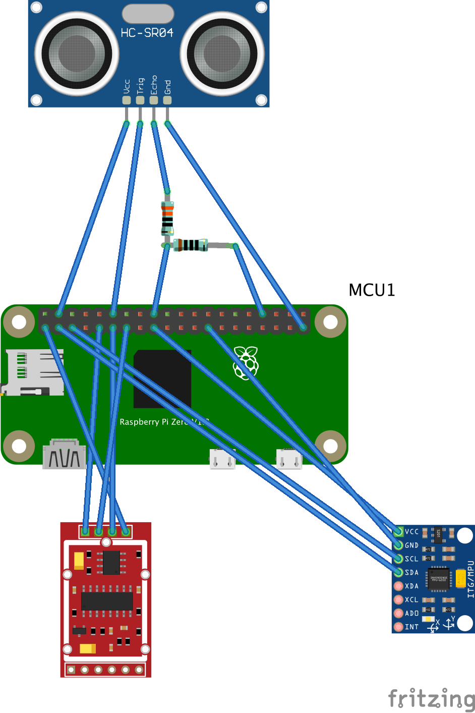

# Hardware build
This directory contains the hardware build instructions.


# Sensors


+ Gyroscope Sensor: Look at README.md in gyroscope.
+ Force Sensors: Look at README.md in force_sensors.
+ Distance Sensors: Look at README.md in distance_sensors.
+ Velocity Sensors: Look at README.md in velocity_sensors (not yet started).

# Software
This directory contains the backend for the sensors.

## Preparation
```
sudo apt-get install -y python3-venv
python3 -m venv venv
source venv/bin/activate
python3 -m pip install -r requirements.txt
```

## Drawing the wires
```brew install fritzing```