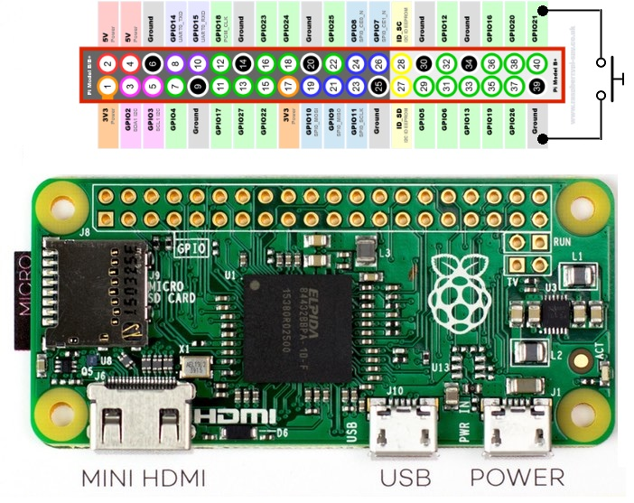

# Hardware build
This directory contains the hardware build instructions.


# Gyroscope Sensor
- Used: MPU-6050

## More possibilities?
- There is a bluetooth version, too: https://github.com/fundiZX48/pymotiontracker

## Wiring
+ https://tutorials-raspberrypi.de/rotation-und-beschleunigung-mit-dem-raspberry-pi-messen/

Raspberry Pi	- MPU 6050
Pin 1 (3.3V)	- VCC
Pin 3 (SDA)	    - SDA
Pin 5 (SCL)	    - SCL
Pin 6 (GND)	    - GND

## Software
+ Enable I2C I/O using `sudo raspi-config`
+ Add the following modules to `/etc/modules`: `i2c-bcm2708` and `i2c-dev`
+ Install the I2C tools `sudo apt-get install i2c-tools python-smbus`
+ Check whether 68 exists in `sudo i2cdetect -y 1`
+ Ref: https://github.com/rocheparadox/Kalman-Filter-Python-for-mpu6050


# Force Sensors
- *Not implemented yet*
- HX711 analog-to-digital converter
- Load Cells

## HX711 Fix


## Raspi Wiring - HX711
3v3    - Vcc
GPIO17 - DT
GPIO27 - SCK



## HX711 Wiring - Load Cell
Red   - E+
Black - E-
White - A-
Green - A+

# Velocity Sensors
- *Not implemented yet*
- To build a linear encoder with the rotary encoder KY-040 you could follow the instructions of the [Braincoder](./velocity_sensors/linear_encoder/Braincoder.pdf).
- The pdf with the instructions (in spanish) the the 3d models are in `hardware/velocity_sensors/linear_encoder`.


## Raspi Wiring


# Software
This directory contains the backend for the sensors.

## Preparation
```
python3 -m venv venv
source venv/bin/activate
python3 -m pip install -r requirements.txt
```

## Running the backend
```
./startup.sh
```

