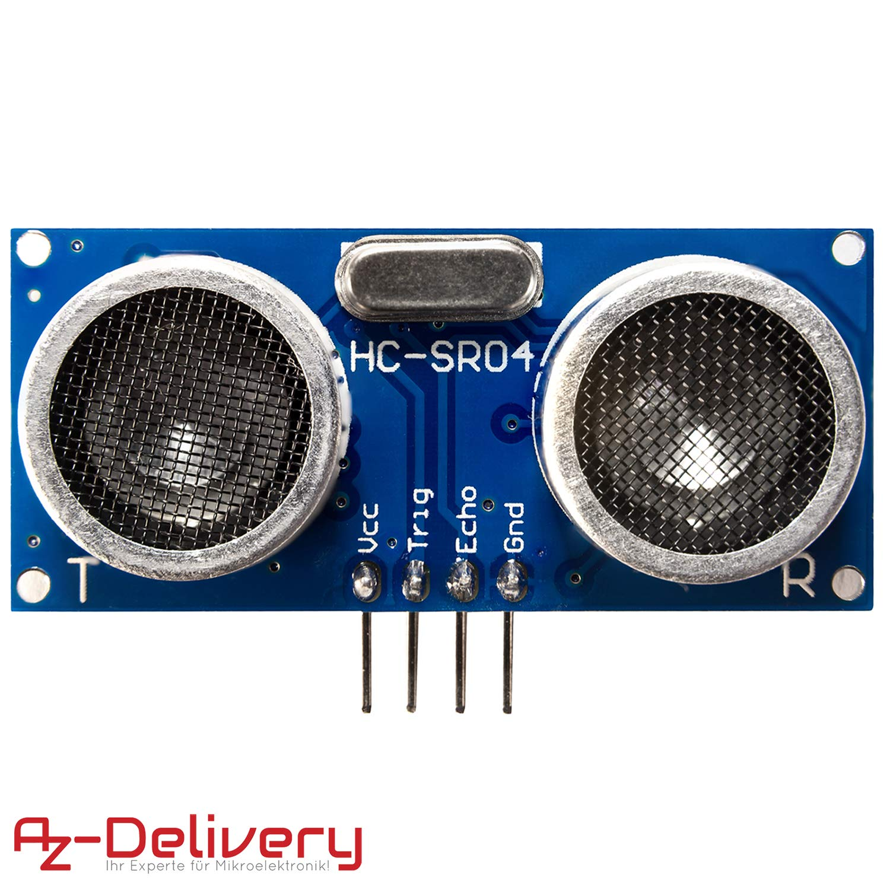

# Distance sensor

# Hardware setup
| Raspi GPIO      | Module   | Module Pin |
|-----------------|----------|------------|
| Pin 2 (VCC)     | HC-SR04  | VCC        |
| Pin 6 (GND)     | HC-SR04  | GND        |
| Pin 12 (GPIO18) | HC-SR04  | TRIG       |
|                 | R1: 330Ω | ECHO       |
| Pin 18 (GPIO24) | R1: 330Ω |            |
|                 | R1: 330Ω | R2: 10kΩ   |
| Pin6 (GND)      |          |  R2: 10kΩ  |

# Software Setup

# Information
+ Must be used in conjunction with a kalman filter.

# References
+ AZDelivery HC-SR04 Ultraschall Modul Entfernungsmesser Sensor kompatibel mit Raspberry Pi inklusive E-Book!
+ https://tutorials-raspberrypi.de/entfernung-messen-mit-ultraschallsensor-hc-sr04/
+ https://github.com/rizkymille/ultrasonic-hc-sr04-kalman-filter
+ https://github.com/NagarajSMurthy/Kalman-estimation-of-ultrasonic-sensor
