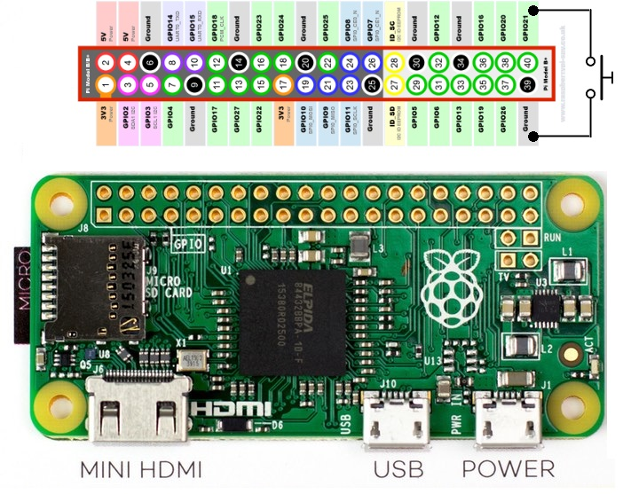

#  Velocity Sensors
- *Not implemented yet*
- To build a linear encoder with the rotary encoder KY-040 you could follow the instructions of the [Braincoder](./linear_encoder/Braincoder.pdf).
- The pdf with the instructions (in spanish) the the 3d models are in `./linear_encoder`.

## Raspi Wiring
